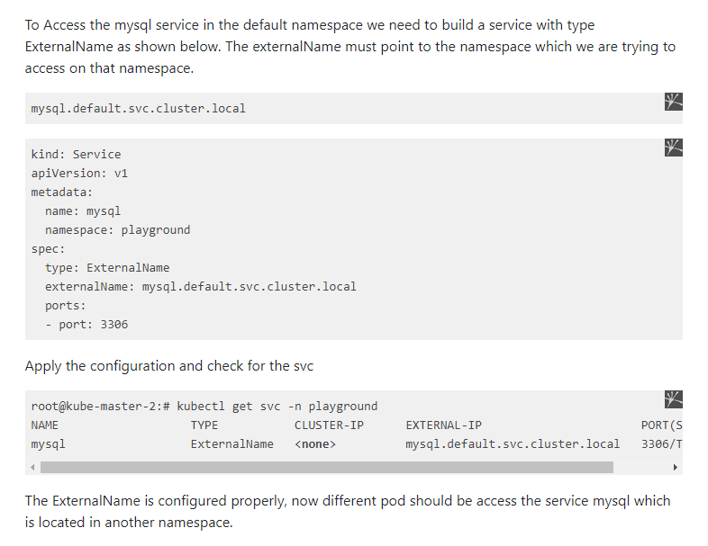

## setup ingress controller

you can find kong ingress controller setup in file `kong-ingress-controller-db-mode.yaml` run it via: `kubectl apply -f kong-ingress-controller-db-mode.yaml`

# notes
 1- stateful sets are hard to replicate in kubernates it better to use external service, you can find all sateful sets services in "stateful-services" dir and deploy them separatly.

2- as we use a private registry of docker we need to add a secret in our cluster so kubelete be able o pull images from it, use the command below to add a secret: 

`kubectl create secret docker-registry secret1 \
        --docker-server=192.168.1.23:9000 \
        --docker-username=example \
        --docker-password=1234 \
        --docker-email=example@example.com \
        --namespace=default`

## 2.1 important note: to avoid "server gave HTTP response to HTTPS client" Error
if you are using microk8s or minikube you will also allow to add inscure registry to them the same as /etc/docker/daemon.json for docker for microk8s follow the tutorials: https://microk8s.io/docs/registry-private

## 2.2 must enable addon CoreDNS so that apps can access each other using `microk8s enable dns`

# ingress controller (kong proxy) ip : curl -i 192.168.1.21(node ip):{node mapped port}  cluster http entry point

3- adding `annotations: ->  konghq.com/strip-path: "true"` to ingress is important to not pass the path itself so your service as your application will respond with 404.

4- ingress controller kong db mode has kong inside of it and you can access admin apis through service in the cluster `http://kong-proxy:443` but kong-proxy only avalaible in the same namespace by default, in case if you want to access it from another namespace use the cluster-ip of the service instead of the name or even better by creating another service in the default namespace and refer to kong-proxy in the kong namespace to access it as shown here:

5- kong ingress controller setup file has a postgres db in it but we are using external postgres db.
