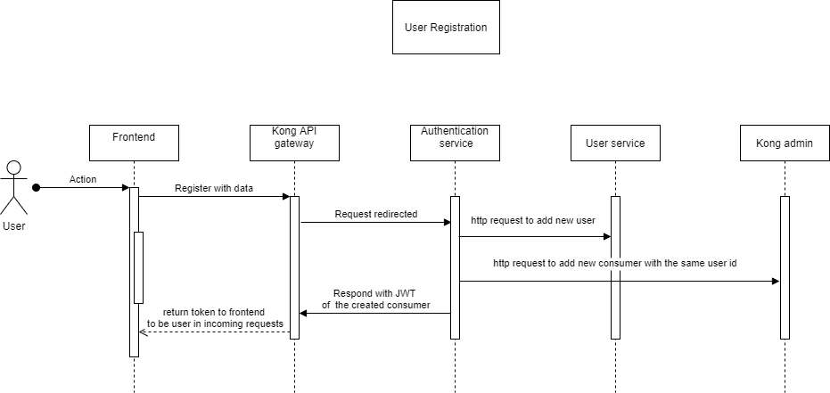

## project setup explaination

simply each service is mapped with a route configured in kong as explained "kong_konga_services_setup dir" and to protect services endpoints from being accessed by unauthenticated user we use JWT plugin of kong and apply it on all services except for authentication service.

## notes

1- authentication-service and user service are separated for learning purposes they can be only one service.

2- creating consumer for each user is also optional for authentication, but also we don't want all users to access apis with the JWT we do so.

## user registration sequence flow in the app

